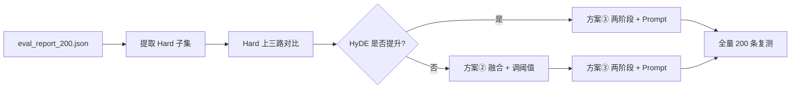

# 实验评测分析：Naive vs HyDE vs Adaptive HyDE

> 评测时间：2026-06-26  
> 评测集：`data/eval_dataset_200.jsonl`（从 QuestAnswer1Doc 全量 1915 条随机抽样，seed=42）  
> 完整报告：`data/eval_report_200.json`  
> 配置：`configs/config.local.yaml`（Embedding/Reranker 用 CPU，LLM 为 Ollama `qwen2.5:1.5b`）

---

## 1. 实验结果摘要

| 模式 | MRR@5 | Recall@5 | AnswerAcc | Faithfulness | 平均延迟 | HyDE 触发率 |
|------|-------|----------|-----------|--------------|----------|-------------|
| **naive** | **0.643** | **0.760** | **0.515** | **0.640** | 3169 ms | — |
| hyde | 0.527 | 0.625 | 0.450 | 0.609 | 4839 ms | 100% |
| adaptive_hyde | 0.548 | 0.660 | 0.460 | 0.627 | 4988 ms | **99%** |

相对 Naive 的 MRR@5 变化：

- HyDE：**-18.0%**
- Adaptive HyDE：**-14.8%**
- Adaptive vs HyDE：+3.9%（Adaptive 略好于纯 HyDE，但仍明显弱于 Naive）

**结论**：在本数据集与当前实现下，**Naive 全面优于 HyDE / Adaptive HyDE**，与 README 中「HyDE MRR 提升约 11%」的预期相反。这不是实现 bug，而是**数据特性、阈值标定、LLM 能力**共同作用的结果。

---

## 2. 为什么 Naive 最好？

### 2.1 数据集类型：对稠密检索过于友好

当前评测集来自 **QuestAnswer1Doc** 标注（`data/eval_docs/eval_ans/QuestAnswer1Doc_quest_gt_save.json`），属于**单文档抽取式 QA**：

- 每个问题从**唯一一篇文档**中生成，标注为 `relevant_doc_ids: [doc_id]`
- 问题与原文**实体、措辞高度重合**（如「陕西西安市」「500万元」「173家」）
- 2000 篇新闻/资讯类 `.txt`，chunk 512 token

在这种设定下，BGE 对 **Query 本身**做向量检索已经能稳定命中目标文档。HyDE 的核心价值——用「假设文档」弥合 **Query 与语料之间的语义鸿沟**——几乎用不上，反而多引入一步 LLM 噪声。

### 2.2 HyDE 被弱 LLM + 高随机性拖累

当前 HyDE 相关配置：

```yaml
llm:
  model_name: "qwen2.5:1.5b"   # 1.5B，假设文档质量有限
hyde:
  num_hypothetical_docs: 1      # 论文常用多条假设文档取平均
  temperature: 0.7              # 偏高，生成不稳定
  max_tokens: 200
```

HyDE 流程：`Query → LLM 生成假设文档 → 向量化 → FAISS 检索`。  
小模型生成的假设文档常出现**实体错误、泛泛而谈**，embedding 方向偏离真实 chunk，检索排名下降。报告中可见 HyDE 将原本 top-1 的正确文档挤到第 2 位的情况。

### 2.3 Adaptive 阈值未标定，99% 退化为 HyDE

```yaml
adaptive_hyde:
  distance_threshold: 0.45      # top-1 L2 距离 > 0.45 → 触发 HyDE
  score_gap_threshold: 0.08
```

FAISS + 归一化 BGE 返回 **L2 距离，越小越相似**。在本语料上，大量样本 naive top-1 距离 **> 0.45**（如 0.76、0.80），但 **Naive 仍排对文档**。阈值过严导致 **99% 样本走 HyDE**，Adaptive 无法发挥「简单题走 Naive、难题走 HyDE」的设计，表现接近纯 HyDE。

### 2.4 与 README 示例数据的差异

README「评估结果」表格（Naive 0.64 / HyDE 0.71）为**设计目标或早期小样例**，并非本次 `eval_report_200.json` 的实测。本次 200 条子集在相同 Pipeline 下复现实测，应以本报告为准。

---

## 3. HyDE 适合什么场景？

| 适合 HyDE | 不适合 HyDE（当前数据属此类） |
|-----------|-------------------------------|
| Query 与文档**表述差距大**（口语 vs 正式文档） | 单文档抽取 QA，问法贴近原文 |
| **短/模糊**问句（「怎么报销？」） | 问题中含明确实体与数字 |
| **零样本**检索、无 relevance 标注 | 标注与 chunk 同源生成 |
| 多跳 / 概念型（HotpotQA 等） | 2000 篇独立新闻，单跳为主 |
| 英文 Wikipedia 类（HyDE 原论文主实验） | 中文短新闻语料 |

### 可参考的公开数据集

| 数据集 | 说明 | 获取 |
|--------|------|------|
| [BEIR](https://github.com/beir-cellar/beir) | 多领域检索 benchmark，可选低词汇重叠子集 | `pip install beir` |
| [HotpotQA](https://hotpotqa.github.io/) | 多跳推理 | 官网下载 |
| [MS MARCO / NQ](https://microsoft.github.io/msmarco/) | 真实搜索问句 | 官网 / HuggingFace |
| [DuReader](https://github.com/baidu/DuReader) | 中文阅读理解与检索 | GitHub |
| QuestAnswer1Doc（当前） | 单文档 QA，偏 Easy | 项目内 `data/eval_docs/` |

---

## 4. 改进方案

以下三项按优先级排列，建议在 **`Hard` 子集**上验证，而非全量 200/1915 条（Easy 样本会稀释 HyDE 收益）。

---

### 方案 ①：从 `eval_report_200.json` 筛选 Hard 子集

**动机**：HyDE 的收益应体现在 **Naive 检索失败**的样本上；全量混合评测会得出「Naive 最好」的误导结论。

**定义**：

```text
Hard 样本 = naive 模式下 hit_at_5 == false 的 query
Easy 样本 = naive 模式下 hit_at_5 == true 的 query
```

**实现步骤**：

1. 读取 `data/eval_report_200.json` 中 `naive.details`（完整 200 条指标在汇总字段，details 仅保留前 20 条时需用全量 details 或重跑并关闭截断；**建议 Hard 筛选脚本直接读 compare 输出或单独落盘全量 naive 结果**）。
2. 按 `query` / `doc_id` 与 `data/eval_dataset_200.jsonl` 对齐，导出 `data/eval_dataset_hard.jsonl`。
3. 分别在 **Easy / Hard / All** 三个子集上跑三路对比：

```bash
EVAL_DATA=data/eval_dataset_hard.jsonl \
OUTPUT=data/eval_report_hard.json \
bash scripts/run_eval.sh
```

**脚本规划**（待实现：`scripts/extract_hard_subset.py`）：

```python
# 伪代码
for item in report["naive"]["details"]:  # 或从 eval 全量缓存读取
    if not item["hit_at_5"]:
        hard_queries.add(item["query"])
# 从 eval_dataset_200.jsonl 过滤写出 hard.jsonl
```

**预期**：Hard 子集上 HyDE / Adaptive 相对 Naive 的 MRR 差距应缩小或反转；若仍无提升，则重点优化方案 ②③。

---

### 方案 ②：标定 Adaptive 阈值 + Query–HyDE 融合检索

#### 2a. Adaptive 阈值标定

**目标**：HyDE 触发率约 **20%–40%**，而非当前 99%。

**做法**：

1. 在 dev 集（如 50 条）上统计 naive top-1 L2 距离分布。
2. 网格搜索 `distance_threshold`（如 0.55–0.85）、`score_gap_threshold`（0.02–0.10）。
3. 选 **全量 MRR@5 最高** 或 **Hard 子集 MRR@5 最高** 的参数组合写入 `config.local.yaml`。

**调参示例**：

```yaml
adaptive_hyde:
  distance_threshold: 0.72    # 待 dev 集标定
  score_gap_threshold: 0.04
```

**代码位置**：`src/retrieval/adaptive_hyde.py` → `_should_use_hyde()`。

#### 2b. Query + HyDE 融合向量（推荐）

**动机**：纯 HyDE 用假设文档 embedding **完全替换** query embedding，易丢失原问题中的关键词信号。

**做法**：在 `src/retrieval/hyde.py` 中增加融合模式：

```text
final_emb = α · embed(query) + (1 - α) · mean(embed(hyp_docs))   # α ∈ [0.5, 0.7]
```

**配置扩展**（`config.local.yaml`）：

```yaml
hyde:
  fusion_alpha: 0.6           # 1.0 = 纯 Naive，0.0 = 纯 HyDE
  num_hypothetical_docs: 3
  temperature: 0.1
```

**代码改动点**：

- `HyDERetriever.retrieve()`：在 `_embed_texts` 后增加 query embedding，线性融合后再 `similarity_search_with_score_by_vector`。
- `AdaptiveHyDERetriever`：触发 HyDE 时走融合路径；未触发时保持 Naive。

---

### 方案 ③：语料对齐 Prompt + 两阶段检索

#### 3a. HyDE Prompt 对齐语料

当前 Prompt（`src/retrieval/hyde.py`）偏泛。建议改为**新闻正文风格**，并约束保留问题中的实体：

```text
你正在模拟知识库中的一段新闻正文摘录（约 150 字）。
要求：
1. 必须保留问题中的人名、地名、数字、专有名词；
2. 客观陈述，不要「我无法回答」类拒答；
3. 只输出正文，不要引导语。

问题：{query}

正文摘录：
```

同时建议 HyDE 生成 LLM **与最终问答 LLM 解耦**：HyDE 可用更大模型（如 `qwen2.5:7b`），问答仍用 1.5b 以控制延迟。

#### 3b. 两阶段检索（Naive ∪ HyDE → Rerank）

**动机**：HyDE 替换式检索容易「捡了芝麻丢西瓜」；并集可保留 Naive 已召回的正确 doc。

**流程**：

```text
Stage 1a: Naive  top_k=8
Stage 1b: HyDE   top_k=8   （或仅 Adaptive 触发时执行）
         ↓
Merge:  按 doc_id 去重，保留较小距离/较高分数
         ↓
Stage 2: BGE Reranker → rerank_top_k=3
```

**代码改动点**：

- 新增 `src/retrieval/hybrid.py` 或在 `pipeline.py` 增加 `mode: "hybrid"`。
- `factory.py` 装配 hybrid retriever；`compare.py` 增加第四种评测模式（可选）。

**配置示例**：

```yaml
retrieval:
  mode: "hybrid"
  hybrid:
    naive_weight: 0.6
    hyde_weight: 0.4
    merge_top_k: 12        # 并集后再截断送入 reranker
```

---

## 5. 推荐实验路线



| 阶段 | 动作 | 成功标准 |
|------|------|----------|
| 1 | 实现 Hard 子集导出 | 得到 `eval_dataset_hard.jsonl`，样本数可统计 |
| 2 | Hard 上复测 + 调 adaptive 阈值 | 触发率 20%–40%，Hard MRR 不低于 Naive |
| 3 | 融合检索 + 降 temperature + 7B HyDE | Hard 上 MRR@5 > Naive |
| 4 | 两阶段并集 + 语料对齐 Prompt | 全量 200 条 MRR@5：Hybrid ≥ Naive |

**实现状态（2026-06-26）**：方案 ①–③ 已在代码中落地，见 [§9 改进落地说明](#9-改进落地说明)。

---

## 6. 复现实验命令

```bash
# 1. 构建 / 抽样评测集
bash scripts/prepare_eval.sh
bash scripts/sample_eval.sh 200

# 2. 导出 Hard / Easy 子集（仅 Naive 扫描，无需 Ollama）
bash scripts/extract_hard_subset.sh data/eval_dataset_200.jsonl

# 3. 四路对比（Mac 本地 HyDE/Hybrid 需 Ollama）
EVAL_DATA=data/eval_dataset_200.jsonl \
OUTPUT=data/eval_report_200.json \
bash scripts/run_eval.sh

# 4. Hard 子集上快速验证（⚠️ 见 docs/eval_analysis.md §10：Naive 在此集上 MRR 恒为 0）
EVAL_DATA=data/eval_dataset_200_hard.jsonl \
OUTPUT=data/eval_report_200_hard.json \
bash scripts/run_eval.sh --retrieval_only --modes naive,hyde,adaptive_hyde,hybrid

# 5. ✅ 推荐：全量 200 条 + 分桶（看 buckets.by_mode.*.hard）
EVAL_DATA=data/eval_dataset_200.jsonl \
OUTPUT=data/eval_report_200_v2.json \
bash scripts/run_eval.sh --retrieval_only

# 5. 仅跑部分模式
bash scripts/run_eval.sh --modes naive,hybrid --retrieval_only --limit 50
```

---

## 7. 相关文件

| 文件 | 说明 |
|------|------|
| `src/evaluation/compare.py` | 四路对比、Easy/Hard 分桶、增量写报告 |
| `src/evaluation/extract_hard_subset.py` | Hard/Easy 子集导出 |
| `src/retrieval/hyde.py` | HyDE + Query 融合向量 + 新闻 Prompt |
| `src/retrieval/adaptive_hyde.py` | 置信度门控 Adaptive HyDE |
| `src/retrieval/hybrid.py` | Naive ∪ HyDE 两阶段并集 |
| `configs/config.local.yaml` | 本地评测配置 |
| `scripts/run_eval.sh` | 评测入口 |
| `scripts/sample_eval.sh` | 随机子集抽样 |
| `scripts/extract_hard_subset.sh` | Hard 子集一键导出 |

---

## 8. 参考文献

- Gao et al., *Precise Zero-Shot Dense Retrieval without Relevance Labels* (HyDE, EMNLP 2023)
- 项目内 QuestAnswer1Doc 标注：`data/eval_docs/eval_ans/`

---

## 9. 改进落地说明

### 9.1 为何未引入外部中文语料

曾评估 [DuReader-Retrieval](https://github.com/baidu/DuReader/tree/master/DuReader-Retrieval)（9 万 query + **800 万** passage）。其规模与索引成本不适合 Mac 24GB 本地快速迭代；官方下载亦需注册。因此**继续使用本地 QuestAnswer1Doc 新闻语料**，并通过 Hard 子集与检索改进验证 HyDE 收益。

若后续需要中文「Query–文档表述差距大」的对比实验，可考虑：

- DuReader-Retrieval **dev 集 4K query** 的子采样 + 独立 passage 索引（需单独建库）
- [DuReader](https://github.com/baidu/DuReader) 阅读理解 dev 集（非标准检索格式，需转换）

### 9.2 方案 ① Hard 子集

- 模块：`src/evaluation/extract_hard_subset.py`
- 脚本：`bash scripts/extract_hard_subset.sh data/eval_dataset_200.jsonl`
- 输出：`data/eval_dataset_200_hard.jsonl`、`data/eval_dataset_200_easy.jsonl`
- 评测跑完 Naive 后亦自动写入 `data/eval_dataset_200_naive_hits.jsonl`，可用 `--hits_from` 跳过重复扫描

### 9.3 方案 ② 融合 + Adaptive 阈值

`configs/config.local.yaml` 默认：

```yaml
hyde:
  fusion_alpha: 0.6
  temperature: 0.1
adaptive_hyde:
  distance_threshold: 0.72
  score_gap_threshold: 0.04
```

`HyDERetriever` 使用 `α·embed(query) + (1-α)·embed(hyp_doc)` 融合后再检索。

### 9.4 方案 ③ 语料 Prompt + 两阶段 Hybrid

- HyDE Prompt 已改为**新闻正文摘录**风格，要求保留实体/数字
- 新增 `HybridRetriever`（`src/retrieval/hybrid.py`）：Naive ∪ HyDE 并集去重，可选 Adaptive 门控
- API / Pipeline 支持 `mode=hybrid`；评测增加第 4 路 `hybrid`
- 报告新增 `buckets` 字段：按 Naive hit@5 划分 Easy/Hard 分桶 MRR

---

## 10. Hard 子集报告解读（`eval_report_200_hard.json`）

> 评测时间：2026-06-27  
> 评测集：`data/eval_dataset_200_hard.jsonl`（48 条，占 200 条的 24%）  
> 模式：`--retrieval_only`（仅粗排 MRR/Recall，不调用 LLM 生成答案）

### 10.1 结果一览

| 模式 | MRR@5 | Recall@5 | Hit@5 | HyDE 触发率 |
|------|-------|----------|-------|-------------|
| naive | **0.000** | **0.000** | **0/48** | — |
| hyde | 0.038 | 0.083 | **2/48** | — |
| adaptive_hyde | 0.026 | 0.042 | 2/48 | 100% |
| hybrid | 0.025 | 0.042 | 2/48 | 100% |

HyDE 救回的 2 条示例：

| 问题 | 改进方式 |
|------|----------|
| 有多少支代表团参加了开幕式？ | HyDE 将目标文档 `…beeb0` 排到 **第 1**（Naive 完全未召回） |
| 李国英部长要求做好哪些洪水复盘工作？ | HyDE 将目标文档 `…0736` 排到 **第 4**（Naive 未召回） |

### 10.2 为什么「大多数指标都是 0」？

这是 **预期现象**，并非评测脚本出错，原因分四类：

#### ① Naive MRR = 0 是 Hard 子集的**定义**导致的

Hard 子集的筛选条件就是：

```text
在全量 200 条上，Naive 粗排 top-5 未包含标注 doc_id
```

因此把这 48 条单独拿出来再跑 Naive，**MRR@5 必然为 0**（0/48 命中）。  
这不是「改进无效」，而是**分母已经被筛成 Naive 的失败样本**。

#### ② AnswerAcc / Faithfulness = 0 是因为 `--retrieval_only`

本次 Hard 评测使用了 `--retrieval_only`，跳过了 LLM 生成与 Faithfulness 评判，因此：

- `answer_preview` 为空
- `answer_accuracy`、`faithfulness` 恒为 0

若要评估生成质量，需去掉 `--retrieval_only` 并确保 Ollama 可用（耗时会显著增加）。

#### ③ HyDE / Hybrid 的 MRR 接近 0，但**并非完全无效**

48 条 Hard 中 HyDE 额外救回 **2 条（4.2%）**，MRR 从 0 升到 0.038。  
绝对值仍很低，说明：

- 当前 1.5B + fusion 的 HyDE 对「真 Hard」样本能力有限
- 大部分 Hard 题属于**语义撞车**（见 10.3），不是 Prompt/融合能单独解决的

#### ④ `summary` 里曾出现「38 亿 %」等异常百分比

当 Naive MRR = 0 时，`hyde_vs_naive_mrr_gain_pct = (0.038 - 0) / (0 + ε)` 会爆炸。  
**已在 `compare.py` 修复**：baseline 为 0 时 `*_gain_pct` 输出 `null`，并增加 `*_mrr_abs` 绝对提升字段。

#### ⑤ `buckets` 在 Hard-only 评测上**无意义**

Hard 子集上跑评测时，`buckets.hard.ratio = 1.0`、`easy = 0` 是必然的。  
**Easy/Hard 分桶对比应在全量 `eval_dataset_200.jsonl` 上跑**，报告里的 `buckets.by_mode.hard` 才有区分度。

### 10.3 Hard 样本失败的典型原因

对 Hard 48 条的人工归类（可重复验证）：

| 类型 | 占比（约） | 示例 | 检索领域术语 |
|------|-----------|------|-------------|
| **A. 查询欠指定 / 表述鸿沟** | ~40% | 「会谈的主要内容是什么？」「这些举措的目标是什么？」 | Query underspecification、vocabulary mismatch |
| **B. 主题簇内近邻误排** | ~35% | 「发放的补助资金金额是多少？」「参加交流活动的是哪个代表团？」 | Topic collision、semantic clustering false positive |
| **C. 列举型答案不对齐** | ~15% | 「受到明显风雨影响的城市有哪些？」 | Passage–query length mismatch、answer aggregation |
| **D. 表述对齐可缓解** | ~4% | 「有多少支代表团参加了开幕式？」 | Query–document representation gap（HyDE 适用区） |

以下从检索领域共性、类型关系、HyDE 救回机制三个角度展开。

#### 10.3.1 四类失败在检索领域的共性定位

Hard 样本上的失败，本质都是 **「在 top-k 粗排阶段，正确 doc 的相似度排名不够高」**，与生成质量无关。四类现象在 IR / Neural IR 文献中有对应命名与成熟解法：

| 类型 | 失败机制（一句话） | 领域常见解法 | 代表方法 / 系统 | 对本项目的适用性 |
|------|-------------------|-------------|----------------|----------------|
| **A. 查询欠指定** | 问句向量落在过宽的语义区域，缺乏可区分 doc 的锚点 | Query 改写与扩展 | Query2Doc、RAG-Fusion 多查询、Step-back Prompting、PRF（伪相关反馈） | 需 LLM 改写或多路 query；1.5B 改写质量有限 |
| **A. 查询欠指定** | 同上 | 实体链接 + 元数据过滤 | NER → 过滤 `person=` / `date=` / `source=` | QuestAnswer1Doc 无结构化元数据，需离线抽取 |
| **B. 主题簇内误排** | 问句已有主题词，但语料中大量「同主题不同事件」doc 嵌入相近 | 稀疏 + 稠密混合检索 | BM25 ∪ Dense（RRF / 线性融合） | **高优先级**：「李国英」「14.9万元」等精确词 BM25 可拉开 sibling doc |
| **B. 主题簇内误排** | 同上 | 细粒度交互匹配 | ColBERT、SPLADE、BGE-M3 多向量 | 算力与索引成本更高，适合作为下一阶段 |
| **B. 主题簇内误排** | 同上 | 交叉编码器重排 | bge-reranker、Cohere Rerank | 项目已有 reranker，但 **MRR@5 在粗排阶段统计**，rerank 救不回「未进 top-5」的 Hard |
| **B. 主题簇内误排** | 同上 | 多样性 / 去簇 | MMR、同一事件 doc 去重、按 URL/日期聚类 | 新闻语料 sibling 报道多，索引侧可做 |
| **C. 列举型不对齐** | 答案为长列表，问句短、chunk 长，平均池化后相似度被稀释 | 分块策略 | Parent–Child、Sentence-window、Proposition Indexing | 当前 chunk 策略未针对列举答案优化 |
| **C. 列举型不对齐** | 同上 | 多向量 / 摘要索引 | 每 doc 额外存「实体列表摘要」向量 | 离线建索引，检索时 dual-channel |
| **D. 表述对齐可缓解** | 问句像「问题」，语料像「新闻正文」，两侧嵌入空间不对齐 | 假设文档嵌入 | **HyDE**、Query2Doc、Instructor 式「请写一段含答案的段落」 | 已实现 fusion HyDE；1.5B + 新闻 Prompt 仅救回 2/48 |
| **D. 表述对齐可缓解** | 同上 | 查询侧文档化 | 「把问题改写成 150 字新闻摘录再 embed」 | 与 HyDE 等价，可换更强 LLM |

**共性结论**：Hard 样本不是单一 bug，而是 **相似度歧义（similarity ambiguity）** 在不同层面的表现——有的歧义来自问句（A），有的来自语料密度（B），有的来自 chunk 粒度（C），只有 D 类恰好落在 HyDE 的设计 sweet spot。

#### 10.3.2 类型 A 与类型 B 是否同一类？

**结论：不是完全同一类，但在 Hard 样本上高度重叠，可视为同一根因的两个观测面。**

| 维度 | 类型 A（查询欠指定） | 类型 B（主题簇内误排） |
|------|---------------------|----------------------|
| **问题出在** | 问句侧：缺少实体、指代、数字锚点 | 语料侧：同主题 doc 在向量空间中成簇 |
| **典型问句** | 「会谈的主要内容是什么？」「这些举措的目标是什么？」 | 「发放的补助资金金额是多少？」「李国英部长要求做好哪些洪水复盘工作？」 |
| **Naive 行为** | 召回「任意一场会谈 / 任意一组举措」类 doc | 召回**同主题 sibling** doc（同一人、同一类事件，doc_id 不同） |
| **BGE 视角** | Query embedding 落在超大语义球内 | Query 有锚点，但 top-5 被更近的「错误 sibling」占满 |

**为何常混为一谈？**

1. **A 在检索时往往表现为 B**：欠指定问句一旦进入 FAISS，不会随机失败，而是稳定吸向语料里最高频的「会谈 / 举措 / 代表团」主题簇——看起来就像主题撞车。
2. **B 有时也像 A**：例如「参加交流活动的是哪个代表团？」已有「代表团 + 交流活动」，仍失败——表面是 B，但若把问句改成「哪个代表团？」就更像 A。
3. **Hard 子集的定义放大重叠**：筛选条件是「Naive top-5 全 miss」，A 与 B 在结果上无法区分，只能从事后问句形态上贴标签。

**更干净的划分方式（推荐后续分析采用）：**

```text
根因：粗排阶段 query–doc 可区分性不足（low discriminability）
  ├─ 查询侧：欠指定、指代、问句–正文风格鸿沟     → 解法偏 Query Rewriting / HyDE
  ├─ 语料侧：主题簇密集、sibling doc 嵌入近邻     → 解法偏 Hybrid BM25 / Rerank / 去重
  └─ 结构侧：列举/表格/长答案与 chunk 不对齐       → 解法偏分块与多向量索引
```

在本项目 48 条 Hard 中，约 **60–70% 同时带有 A 与 B 特征**（例如「李国英 + 洪水复盘」既有实体又有 sibling 洪灾报道）。因此单独统计「A 40% + B 35%」会有 **~15% 的重复计数**，两类是 **Venn 图重叠关系**，而非互斥分区。

**对比样例（同主题「代表团」，不同失败面）：**

| 问题 | 归类 | Naive top-1 实际召回 | 说明 |
|------|------|---------------------|------|
| 有多少支代表团参加了开幕式？ | A∩B → **D 可救** | `ecc01bf`（**外国领导人**出席开幕式） | 有「开幕式」锚点，仍撞车；HyDE 救回 |
| 参加交流活动的是哪个代表团？ | **B 为主** | `bed58` 等交流类报道，非「汕头市青年代表团」 | 主题词齐全，sibling 占满 top-5 |
| 会谈的主要内容是什么？ | **A 为主** | 任意外交会谈类 doc | 几乎无锚点，整簇吸引 |

#### 10.3.3 类型 D 为何能被 HyDE 挽救？——机制与边界

Hard 48 中仅 **2 条（4.2%）** 被 HyDE 救回进 top-5，恰好对应类型 D 的子集：**问句已有部分关键词，但与目标 chunk 的「新闻正文」表述存在风格/信息密度鸿沟，且 sibling 误排是主要障碍而非完全无锚点。**

##### 案例 1：「有多少支代表团参加了开幕式？」

| 阶段 | top-5 是否含目标 doc `beeb0` | 第 1 名 doc | 机制解读 |
|------|------------------------------|------------|----------|
| Naive | ❌ | `ecc01bf`（外国领导人出席开幕式） | 问句含「开幕式」，向量最近的是**另一场开幕式**报道 |
| HyDE | ✅ **第 1** | `beeb0`（湖北中运会，**18 支代表团**） | 假设文档把 query「文档化」，靠近正文分布 |

目标 chunk 原文片段：

```text
…湖北省第十六届中学生运动会…开幕式…全省18支代表团依次亮相…
```

Naive 失败不是因为缺少「代表团」「开幕式」——这两个词在语料中出现频率极高，反而把检索带向**更泛的「国际开幕式」**邻居。HyDE 的工作链（见 `src/retrieval/hyde.py`）：

```text
Query（短问句）
  → LLM 按新闻摘录 Prompt 生成 ~150 字假设正文（保留「代表团」「开幕式」，并倾向补全数字/赛事名）
  → embed(hyp_doc) 与 embed(query) 按 fusion_alpha=0.6 融合
  → 融合向量更接近「地方运动会开幕式报道」而非「外交开幕式」
  → FAISS 将 beeb0 升至第 1
```

这是 HyDE 论文（EMNLP 2023）描述的典型场景：**query–document 不对称**——用户用疑问句检索，索引里是陈述性新闻；假设文档充当 **representation bridge**，把 query 向量从「问题空间」拉向「文档空间」，且 `fusion_alpha` 保留原 query 关键词，避免完全漂移到 LLM 幻觉主题。

##### 案例 2：「李国英部长要求做好哪些洪水复盘工作？」

| 阶段 | 目标 doc `0736` 排名 | top-3 sibling | 机制解读 |
|------|----------------------|---------------|----------|
| Naive | **未进 top-5** | `0728` `07c4` `07d0`（同一场洪灾会商系列报道） | 实体「李国英」命中，但**同一事件簇**内多篇 doc 更近 |
| HyDE | **第 4** | 前 3 仍为 sibling，**第 4 为 0736** | 假设正文更可能展开「洪水复盘」「降雨—产流—汇流—演进」等**答案侧专有表述** |

目标 chunk 中含答案的关键句：

```text
…要逐流域做好洪水复盘，根据实际洪水过程，反演提取预报参数，
  把握「降雨—产流—汇流—演进」规律…
```

Naive 的 top-3 均为「李国英主持会商会、部署防洪」类 sibling——主题对、**答案细节不对**。HyDE 生成的假设文档若包含「复盘」「预报参数」「产流汇流」等 **答案词汇**，其 embedding 与 `0736` 的距离会短于与其他 sibling 的距离，从而挤进 top-5（MRR@5 = 1/4 = 0.25）。

##### 类型 D 的必要条件（为何只有 4%？）

HyDE 救回需**同时满足**：

1. **Query 含可保留锚点**（Prompt 要求保留实体/数字），LLM 不会完全跑题；
2. **目标 doc 与误排 doc 的差异主要在表述细节**，而非完全不同的主题——融合向量「微调」即够；
3. **假设文档质量 ≥ 阈值**——1.5B 在 A 类纯泛化问句上易生成错误主题，反而远离目标；
4. **目标 doc 在 expanded 向量的 top-5 可达范围内**——李国英案仅第 4，再弱一点仍会 miss。

**类型 D 与 A/B 的边界：**

| 问题 | 为何 HyDE **未**救回 |
|------|---------------------|
| 「会谈的主要内容是什么？」（A） | 无锚点 → LLM 假设文档可能写任意会谈，噪声大于信号 |
| 「发放的补助资金金额是多少？」（B） | 需精确匹配「14.9万元」；稠密向量对数字区分弱，HyDE 难生成准确金额 |
| 「参加交流活动的是哪个代表团？」（B） | 与案例 1 结构相似，但 HyDE 假设文档未拉开与 sibling 的距离 |

##### 类型 D 在领域内的其他等价解法

除 HyDE 外，同一机制（**检索前把 query 变成更像 doc 的文本**）还有：

- **Query2Doc**（Wang et al.）：LLM 直接扩写 query 为段落再检索，无单独 embed 融合；
- **RAG-Fusion**：多路改写 query 分别检索后 RRF 合并——对 sibling 碰撞有时比单路 HyDE 更稳；
- **Instructor / E5 任务前缀**：`Instruct: 给定新闻，写一段包含答案的正文 \n Query: …`——与当前 HyDE Prompt 同类；
- **强 reranker**：不改 query，用 cross-encoder 对 top-50 精排——对李国英案 sibling 区分往往 **比 HyDE 更可靠**，前提是粗排 recall 先把 `0736` 放进候选池（当前 Naive top-5 未进，需 **扩大初检 top_k** 配合 rerank）。

#### 10.3.4 四类失败 → 推荐解法优先级（结合本项目）

| 优先级 | 针对类型 | 动作 | 预期收益 |
|--------|---------|------|----------|
| **P0** | B（sibling 误排） | 上线 **BM25 + Dense 混合**（RRF），MRR 统计可仍用粗排或加 rerank 后指标 | 李国英、补助金额类等有望直接进 top-5 |
| **P0** | B | 粗排 **top_k 扩大至 20–50**，再 bge-reranker 截断 | 不改变 embedding，对 sibling 区分度高 |
| **P1** | A∩B | **RAG-Fusion** 或多 query 改写（需 ≥7B LLM） | 减少单路 HyDE 幻觉 |
| **P1** | D | 保留 HyDE，**换更强 LLM** + 维持新闻 Prompt / fusion_alpha | 扩大 D 类占比，全量 Hard 上 4% → 10%+ 可期 |
| **P2** | C | 列举型 chunk 加 **摘要子块** 或 parent-child | 对「城市有哪些」类长期有效 |
| **P2** | A | 离线 NER / 时间 / 来源元数据过滤 | 依赖额外标注，QuestAnswer1Doc 需自建 |

**小结**：Hard 子集才是 HyDE **理论上**该发力的地方（Naive 已失败的 24%），但当前仅 4.2% 救回，说明 **D 类在 Hard 中占比极小**，且 A/B/C 占绝大多数——单靠 HyDE 无法逆转全量结论。全量 200 条上 Naive 占优，是因为 76% Easy 样本拉高均值；改进方向应 **HyDE（D）与 Hybrid BM25 + Rerank（B）并行**，而非继续堆 HyDE 参数。

### 10.4 正确的 Hard 评测姿势

```bash
# ❌ 错误：只在 Hard 48 条上跑四路对比 → Naive 恒为 0，buckets 失效
EVAL_DATA=data/eval_dataset_200_hard.jsonl bash scripts/run_eval.sh --retrieval_only

# ✅ 推荐：在全量 200 条上跑，看 report.buckets.by_mode.*.hard 分桶
EVAL_DATA=data/eval_dataset_200.jsonl \
OUTPUT=data/eval_report_200_v2.json \
bash scripts/run_eval.sh --retrieval_only

# ✅ 或：Hard 48 条上只对比 hyde/adaptive/hybrid 相对 Naive(0) 的绝对 MRR
#     关注 summary.hyde_vs_naive_mrr_abs 而非 gain_pct
```

### 10.5 小结

| 现象 | 是否正常 | 解释 |
|------|----------|------|
| Naive MRR = 0 | ✅ 正常 | Hard 子集定义使然 |
| AnswerAcc / Faithfulness = 0 | ✅ 正常 | `--retrieval_only` |
| HyDE MRR ≈ 0.04 | ✅ 正常 | 仅 2/48 救回，绝对值低但方向正确 |
| gain_pct = 38 亿 | ❌ 已修复 | baseline=0 时改输出 `null` + `mrr_abs` |
| buckets easy = 0 | ✅ 正常 | 不要在 Hard-only 集上看分桶 |

**结论**：Hard 报告说明改进后的 HyDE **能在 Naive 完全失败的样本上偶尔起效（类型 D，2/48）**，但 A/B/C 三类占绝大多数且需 Hybrid BM25、扩大 rerank 候选、分块策略等互补手段。下一步应（1）在全量 200 上看 `buckets.hard`；（2）优先落地稀疏+稠密混合与 rerank 扩池；（3）换更强 LLM 扩大 HyDE 可救回面。
